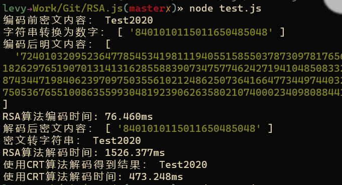

## 导入js
```
const RSA = require('./rsa.js');
```

## 使用两个大质数p,q
```
var p = new RSA.BigInt("106697219132480173106064317148705638676529121742557567770857687729397446898790451577487723991083173010242416863238099716044775658681981821407922722052778958942891831033512463262741053961681512908218003840408526915629689432111480588966800949428079015682624591636010678691927285321708935076221951173426894836169");
var q = new RSA.BigInt("144819424465842307806353672547344125290716753535239658417883828941232509622838692761917211806963011168822281666033695157426515864265527046213326145174398018859056439431422867957079149967592078894410082695714160599647180947207504108618794637872261572262805565517756922288320779308895819726074229154002310375209");
```

## 获取密钥
```
const keys = RSA.get_key(p, q);
const crt_key = RSA.get_crtkey(p,q,keys);
```

## 对加密的字符串进行转数字
```
var s = "Test2020";
var as = RSA.ToAssic(s,50); 
```

## 将密文进行加密成明文
```
var c = RSA.encrypt(as, keys[0]);
```

## 将明文解码成密文
```
var m = RSA.decrypt(c, keys[1]);
```

## 将密文转字符串
```
var str = RSA.FromAssic(m);
```

## 使用CRT算法进行解码
在2048长度的密钥下，使用CRT算法解密将提升3~4倍解码效率
```
var m = RSA.CRTdecrypt(c, crt_key);
var str = RSA.FromAssic(m);
```
