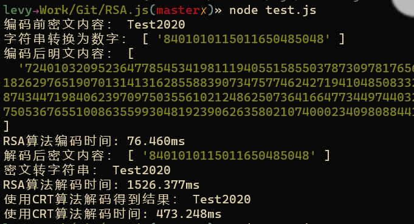

网页cdn链接 [http://js.idealli.com/rsa.web.js](http://js.idealli.com/rsa.web.js)


-- 下面是如何使用rsa.js

# 在网页中使用rsa.js
- 网页中导入
```
<script src="http://js.idealli.com/rsa.web.js"></script>
```

- 使用两个大质数（建议不要放在前端）
```
var p = new BigInt("106697219132480173106064317148705638676529121742557567770857687729397446898790451577487723991083173010242416863238099716044775658681981821407922722052778958942891831033512463262741053961681512908218003840408526915629689432111480588966800949428079015682624591636010678691927285321708935076221951173426894836169");
var q = new BigInt("144819424465842307806353672547344125290716753535239658417883828941232509622838692761917211806963011168822281666033695157426515864265527046213326145174398018859056439431422867957079149967592078894410082695714160599647180947207504108618794637872261572262805565517756922288320779308895819726074229154002310375209");
```

- 生成公钥与密钥
```
const keys = get_key(p, q);
const crt_key = get_crtkey(p,q,keys);  // crt_key在解码的时候可选择使用
```

- 将初始字符串转数值
```
var s = "Test2020";
var as = ToAssic(s,50); 
```

- 获得加密后的明文
```
var c = encrypt(as, keys[0]);
console.log("编码后明文内容：",c);
```

- 对明文进行解码后转字符串，获得结果
```
var m = decrypt(c, keys[1]);
console.log("密文转字符串：",str);
```

- （可选）使用crt算法进行解码
```
var m = CRTdecrypt(c, crt_key);
var str = FromAssic(m);
console.log("使用CRT算法解码得到结果：",str);
```


# 在本地node项目中使用rsa.js

## 导入js
- 在本地文件导入
```
const RSA = require('./rsa.js');
``` 

## 使用两个大质数p,q
```
var p = new RSA.BigInt("106697219132480173106064317148705638676529121742557567770857687729397446898790451577487723991083173010242416863238099716044775658681981821407922722052778958942891831033512463262741053961681512908218003840408526915629689432111480588966800949428079015682624591636010678691927285321708935076221951173426894836169");
var q = new RSA.BigInt("144819424465842307806353672547344125290716753535239658417883828941232509622838692761917211806963011168822281666033695157426515864265527046213326145174398018859056439431422867957079149967592078894410082695714160599647180947207504108618794637872261572262805565517756922288320779308895819726074229154002310375209");
```

## 获取密钥
```
const keys = RSA.get_key(p, q);
const crt_key = RSA.get_crtkey(p,q,keys);
```

## 对加密的字符串进行转数字
```
var s = "Test2020";
var as = RSA.ToAssic(s,50); 
```

## 将密文进行加密成明文
```
var c = RSA.encrypt(as, keys[0]);
```

## 将明文解码成密文
```
var m = RSA.decrypt(c, keys[1]);
```

## 将密文转字符串
```
var str = RSA.FromAssic(m);
```

## 使用CRT算法进行解码
在2048长度的密钥下，使用CRT算法解密将提升3~4倍解码效率
```
var m = RSA.CRTdecrypt(c, crt_key);
var str = RSA.FromAssic(m);
```
